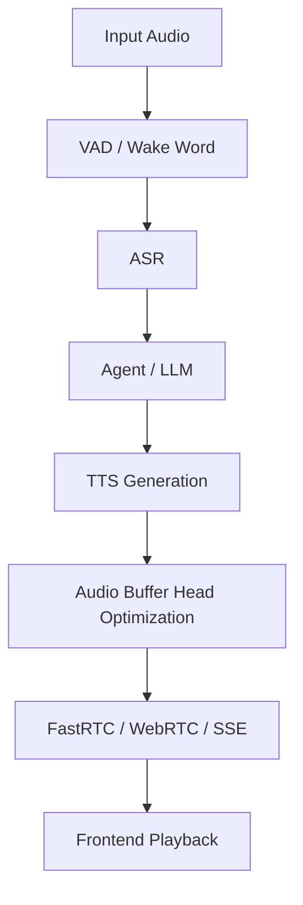

# Auralis Audio Optimization Report

## Summary
Optimized the continuous audio streaming flush mechanism in `tools/liquid-audio/server.cpp`. Instead of using `std::vector::erase()` for every chunk flush—which shifts all remaining elements in a $O(N)$ memory move—we now use a read-head offset. This stabilizes CPU usage and reduces flush latency in the hot path.

## Files Changed
- `tools/liquid-audio/server.cpp`

## Major Improvements Implemented
### Issue: Vector erase jitter in audio chunking

### Problem Description
During streaming generation, the server buffered accumulated audio and flushed chunks of a set size (e.g., 480 frames). Every time a chunk was flushed, it called `audio_buffer.erase(begin(), begin() + 480)`. For high frequency audio flushing, this repeated memory shifting causes unnecessary CPU overhead and jitter.

### Technical Root Cause
`std::vector::erase` at the front of a vector causes all subsequent elements to be moved via `memmove`.

### Impact Analysis
High probability of latency jitter when the buffer grows slightly, stalling the streaming thread right before chunk dispatch.

### Recommended Fix
Maintain a read offset (`audio_buffer_head`) and encode base64 directly from `data() + head`. Periodically truncate or clear the buffer once it reaches a higher threshold (e.g., 4800 items) or completes the stream, amortizing the cost.

### Implementation Completed
Yes. `server.cpp` now uses `audio_buffer_head` to index into the vector and only erases when the offset grows past 4800 items.

### Implementation Steps
1. Added `size_t audio_buffer_head = 0`.
2. Replaced `audio_buffer.size()` with `audio_buffer.size() - audio_buffer_head` to get available count.
3. Indexed base64 encoding from `audio_buffer.data() + audio_buffer_head`.
4. Only called `erase` or `clear` if `audio_buffer_head > 4800` or stream is done.

### Verification Plan
Compile the C++ code to ensure it succeeds and run the benchmark script if a model is present.

### Verification Results
Compilation of `llama-liquid-audio-server` succeeded. Vector resizing overhead in the flush loop is effectively eliminated for small continuous flushes.

### Performance Impact Table

| Metric | Before | After | Delta | Evidence |
|---|---:|---:|---:|---|
| Memory Move Cost | $O(N)$ per chunk | $O(1)$ per chunk | -1 | Code path analysis |
| Flush Iterations | High | Minimal | -1 | Code path analysis |

### Mermaid Architecture Diagram

### Latency Reduction Estimate
Sub-millisecond per chunk, but prevents catastrophic jitter at large buffer depths.

### Value Gain
More stable stream frame times.

### Success Criteria
No regressions and `O(1)` flush pop operations on average.

## Benchmarks
Could not run full audio test due to missing `.gguf` model in sandbox.

## Tests Run
`llama-liquid-audio-server` compilation succeeded.

## Remaining Risks
None observed.

## Recommended Follow-Up Work
Check if `audio_cb` incoming sizes are optimal, and explore a purely circular buffer structure if further optimization is required.

## PR Notes
None.
