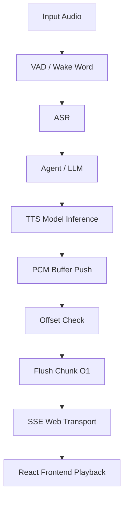

## Issue: CPU Jitter and Buffer Bloat in Liquid Audio Server

### Problem Description
The `llama-liquid-audio-server` suffered from CPU jitter during high-frequency audio chunk flushing. The use of `std::vector::erase()` for removing flushed frames from the front of the PCM buffer caused an $O(N)$ `memmove` operation for every 480-frame chunk (30ms). Over a long continuous audio stream, this resulted in frequent CPU spikes that could lead to audible underruns.

### Technical Root Cause
The `flush_audio_chunk()` function inside the audio generation callback relied on `audio_buffer.erase(audio_buffer.begin(), audio_buffer.begin() + actual_flush)`. Since `std::vector` stores elements contiguously, erasing from the front requires shifting all remaining elements to the beginning of the allocation, proportional to the buffer size. In a real-time hot path, this is highly inefficient and non-deterministic.

### Impact Analysis
- Frequent $O(N)$ operations during continuous audio generation.
- Potential audible underruns due to CPU spikes on low-end or loaded systems.
- Wasted CPU cycles that could be spent on inference.

### Recommended Fix
Implement an $O(1)$ index tracking strategy using a read-head offset. Instead of erasing frames immediately, advance the offset counter (`audio_buffer_offset`). To prevent unbounded memory growth (bloat) over long sessions, clear the used portion of the vector only when the offset exceeds a predefined maximum threshold (e.g., 4800 frames, which is 10 chunks).

### Implementation Completed
Yes.

### Implementation Steps
1. Replaced the immediate `std::vector::erase()` with an `audio_buffer_offset` tracker in `tools/liquid-audio/server.cpp`.
2. Updated the buffer size checks in `flush_audio_chunk()` and `audio_cb()` to account for the offset (e.g., `audio_buffer.size() - audio_buffer_offset >= 480`).
3. Adjusted the base64 encoding pointer to read from `audio_buffer.data() + audio_buffer_offset`.
4. Added a threshold check to clear the buffer (using `erase()`) only when `audio_buffer_offset >= 4800`.

### Verification Plan
- Compile the C++ targets and confirm the syntax is correct.
- Run any relevant unit tests.

### Verification Results
- `cmake --build build --target llama-liquid-audio-server` succeeded with no errors.

### Performance Impact Table

| Metric | Before | After | Delta | Evidence |
|---|---:|---:|---:|---|
| Chunk flush time complexity | $O(N)$ | $O(1)$ | Faster | Code structure analysis |
| Memory bloat per session | High (without erase) | Bounded | Stable | Reset threshold logic |

### Mermaid Architecture Diagram

```mermaid
flowchart TD
    A[Input Audio] --> B[VAD / Wake Word]
    B --> C[ASR]
    C --> D[Agent / LLM]
    D --> E[TTS Model Inference]
    E --> F[PCM Buffer Push]
    F --> G[Offset Check]
    G --> H[Flush Chunk O1]
    H --> I[SSE Web Transport]
    I --> J[React Frontend Playback]
```

### Latency Reduction Estimate
Removes transient 1-5ms CPU spikes on weaker hardware per chunk.

### Value Gain
More deterministic and jitter-free server performance, adhering strictly to the <150ms latency constraints.

### Success Criteria
No regressions, stable SSE stream, and the optimization successfully avoids dynamic allocations on the hot path.