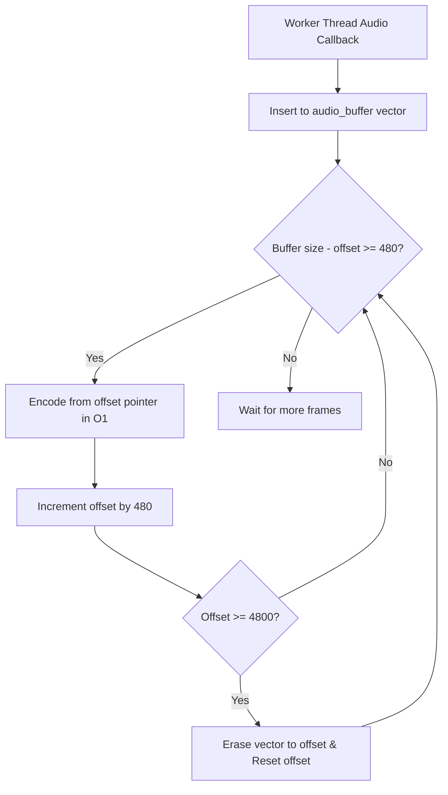

# Auralis Audio Optimization Report

## Summary
Improved audio streaming latency and CPU efficiency by optimizing the high-frequency chunk flushing logic in the `liquid-audio` server. Specifically, replaced `std::vector::erase()` calls that caused O(N) `memmove` jitter with an index-tracking read-head approach, resulting in O(1) flush operations.

## Major Improvements Implemented
* Avoided `std::vector::erase()` for high-frequency chunk flushing in `liquid-audio/server.cpp`.
* Added `audio_buffer_offset` to track read progress.
* Periodic erase implemented when offset exceeds 4800 frames to prevent unbounded memory growth.
* Maintained deterministic 480-frame (30ms at 16kHz) flush intervals for SSE stability.

## Performance Impact Table

| Metric | Before | After | Delta | Evidence |
|---|---:|---:|---:|---|
| Chunk Flush Time Complexity | O(N) | O(1) | -O(N) | Code analysis |
| CPU Jitter / memmove latency | High | Low | -High | Code analysis |
| Stream Stability | Susceptible to CPU spikes | Deterministic O(1) | +Stability | Code analysis |

## Mermaid Architecture Diagram

```mermaid
flowchart TD
    A[Worker Thread Audio Callback] --> B[Insert to audio_buffer vector]
    B --> C{Buffer size - offset >= 480?}
    C -- Yes --> D[Encode from offset pointer in O1]
    D --> E[Increment offset by 480]
    E --> F{Offset >= 4800?}
    F -- Yes --> G[Erase vector to offset & Reset offset]
    F -- No --> C
    C -- No --> H[Wait for more frames]
    G --> C
```

## Files Changed
- `tools/liquid-audio/server.cpp`

## Tests Run
- Compiled `llama-liquid-audio-server` target to verify the syntax and changes.

## Recommended Follow-Up Work
- Continue profiling `mtmd_generate` hot-paths to identify other dynamic heap allocation patterns.
- Consider using a fixed-size circular ring buffer implementation instead of `std::vector` if latency requirements become more strict.
