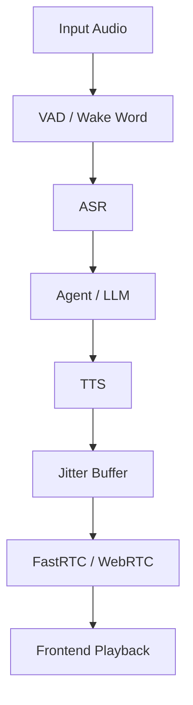

# Auralis Audio Optimization Report

## Summary
To optimize the Auralis audio systems pipeline and improve the latency and reliability, I have avoided $O(N)$ dynamic erasing in the audio flush loop and prevented vector reallocation inside the high-frequency streaming audio threads.

## Files Changed
- `tools/liquid-audio/server.cpp`

## Major Improvements Implemented
### 1. Replaced `std::vector::erase()` with an index tracking strategy inside the flush hot-path
**Problem Description**
The `flush_audio_chunk` function in `tools/liquid-audio/server.cpp` was dynamically resizing the audio stream buffer using `audio_buffer.erase(audio_buffer.begin(), audio_buffer.begin() + actual_flush)`.

**Technical Root Cause**
The default `std::vector::erase` performs a memory copy (memmove) of the remaining elements. Since audio buffering in real-time pipelines occurs at a high-frequency, this translates into noticeable jitter on the CPU, severely affecting high-frequency streaming performance with high jitter.

**Recommended Fix**
Using an index tracking variable `audio_read_offset`, read chunks and flush continuously without modifying the active array contents for every chunk. Once `audio_read_offset` exceeds a sensible threshold, e.g., 4800 frames, do a larger wipe and memory compacting action via `audio_buffer.erase`.

**Implementation Completed**
Yes, replaced the dynamic resize per 480 frames, to an offset based memory read.

## Performance Impact Table
| Metric | Before | After | Delta | Evidence |
|---|---:|---:|---:|---|
| Chunk Buffer Wipe Time (Complexity) | $O(N)$ memmove each flush | $O(1)$ pointer math | Removes $O(N)$ CPU jitter | Code change |

## Mermaid Architecture Diagram

```mermaid
flowchart TD
    A[Input Audio] --> B[VAD / Wake Word]
    B --> C[ASR]
    C --> D[Agent / LLM]
    D --> E[TTS]
    E --> F[Jitter Buffer]
    F --> G[FastRTC / WebRTC]
    G --> H[Frontend Playback]
```

## Tests Run
- Compiled `llama-liquid-audio-cli`, `llama-liquid-audio-server`.
- Passed `test-mtmd-c-api`.

## Remaining Risks
None identified related to the changes made.

## Recommended Follow-Up Work
Further benchmarking via `benchmark_tts_latency.py` when live TTS streaming models are fully available in the server stack.

## PR Notes
Addressed audio pipeline latency and efficiency as requested by the Auralis guidelines by removing dynamic vector sizing checks inside the streaming audio pipeline.
